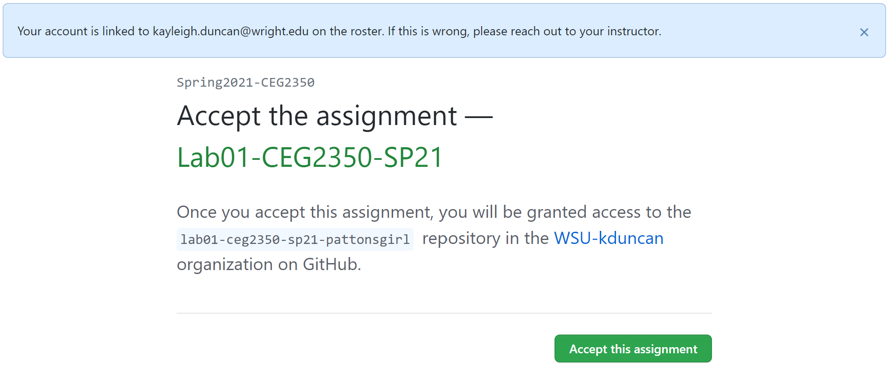

# Guide to GitHub Classrooms

For this course, you will be submitting your lab work to a GitHub repository and submitting a link to your work to the  
corresponding Dropbox on Pilot.  The guide below will help you with setting up the repository you will be required to  
use for this course - it is a **private** repository with permissions set in order to protect your work and share it  
with only myself and the TAs and contains some default content to get started.  

- [Pre-Reqs](#Pre-Reqs)
- [Create the Repo](#Create-the-Repo)
- [Setup SSH Authentication](#Setup-SSH-Authentication)
- [Using your Repository](#Using-your-Repository)
- [Troubleshooting](#Troubleshooting)

## Pre-Reqs:

- Create / have a GitHub account
  - [Sign up](https://github.com/signup?ref_cta=Sign+up&ref_loc=header+logged+out&ref_page=%2F&source=header-home)
- Open a terminal
  - [Environment Setup](EnvironmentSetup.md)
- Create your repo via Pilot link
  - Go to the Pilot page for this course, go to Content, then Labs. 
  - There is a link labeled: "Create GitHub Classroom repo"
  - Click the link, then follow the instruction in [Setup](#Setup)

## Create the Repo

After clicking the "Create GitHub Classroom repo" link in Pilot, you will be taken to GitHub to finish creating your  
repository to use in this course.

1. Select your wright.edu email address from the list shown.
  - If you misclick, email myself or a TA so we can fix it
2. Select `OK` on the popup to confirm you selected the correct email address.
  
3. Select `Accept this assignment`
4. After a minute, refresh the next page. You'll see something similar to:
  
4. Click the lower link / link that looks similar to: `https://github.com/WSU-kduncan/ceg2350-your_GitHub_username`. 
  - The top link sometimes presents an "error" but things are actually fine.
5. It is recommended to bookmark this link for easy access down the road.
  - You can also go to your GitHub profile page and "Pin" the repository

## Setup SSH Authentication

1. [Generate a new SSH key](https://docs.github.com/en/github/authenticating-to-github/connecting-to-github-with-ssh/generating-a-new-ssh-key-and-adding-it-to-the-ssh-agent) with the command:
  - `ssh-keygen -t ed25519 -C "your_email@example.com"`
  - Hit enter to use the default storage location and name
  - Hit enter to **skip** entering a passphrase
  - **NOTE** You need to create a key pair on each system you want to use.
    - AWS Ubuntu system = 1 key pair
    - Your system = 1 key pair
    - A system at wright state = 1 key pair
2. Go to the folder where the key pair was saved.  Look for the file that ends with `.pub`
3. Open the file, and copy its contents
4. [Add your public key to GitHub](https://docs.github.com/en/github/authenticating-to-github/connecting-to-github-with-ssh/adding-a-new-ssh-key-to-your-github-account)
  - Go to "Settings" - "SSH and GPG keys", then select "Add new key"
  - Give your key a useful name that ids which computer it belongs to
  - Paste the contents of the `.pub` file in the box
5. To `clone` the repository:
  - Click the green `Code` button
  - Select `SSH` for SSH key authentication
  - In a terminal use `git clone` followed by the corresponding URL to clone your repository

## Using your Repository

You now have a repository on GitHub, and have added to your GitHub account a public key associated with a private key protected by you.  
This will be discussed in class and lab, but as a cliff notes version, your next steps are to:
- `clone` your repository locally (to the machine you are using)
  - Remember to `clone` your repository to each device you want to work with it on.  Yup, that also means a key pair for each
- `add` new files for tracking, or `add` files that have had changes made to be committed
- `commit` your changes, along with a commit message that states what has changed
- `push` your commit(s) to GitHub
- Refresh your repository on GitHub in your browser to prove it pushed (seeing is believing)
- `status` will output some hints about what is going on and what may need to happen next

## Troubleshooting 
Q. I lost my SSH key (computer died, data deleted, etc), what now?  
A. Your GitHub repository is fine.  It's in "the cloud" (add sparkles and rainbows).  
Follow the steps in [SSH Authentication](#Setup-SSH-Authentication) to generate a new key pair for use with your GitHub account.

Q. It's asking for a passpharase?  
A. In the event that you are asked for a passphrase, you created one when making your SSH key.  There is no undo button.  
Follow the steps in [SSH Authentication](#Setup-SSH-Authentication) to generate a new key pair (and don't put a passphrase this time)  
for use with your GitHub account.
