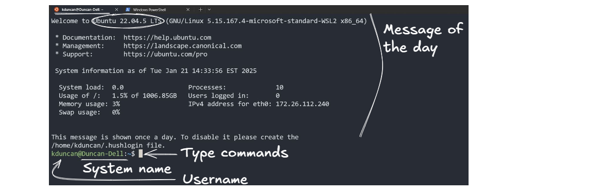

# Your System & Navigation

Objectives:
- definitions of terminal, console, shell, and command prompt
- know your system's shell
- understand how to structure requests to your OS
- practice commands to navigate your filesystem

## History Lesson - Definitions

Terminals & consoles are OG.  Desktop environments are fairly "new".  You now use virtual consoles or terminal emulators to access a shell, which in turn enables the use of the command line.

### Terminal

> A *terminal* refers to a wrapper program which runs a shell. Decades ago, this was a physical device consisting of little more than a monitor and keyboard. As Unix/Linux systems added better multiprocessing and windowing systems, this terminal concept was abstracted into software. 

> Other terminals, sometimes called pseudo-terminals or pseudo-ttys, are provided (through a thin kernel layer) by programs called terminal emulators. Some types of terminal emulators include:
- SSH, which connects a terminal on one machine with programs on another machine
    - You'll see this soon... dun dun dun...
- GUI applications running in the X Window System: Xterm, Gnome Terminal, Konsole, Terminator, etc.
    - You'll see this in our virtual machines lab
- Screen and tmux, which provides a layer of isolation between a program and another terminal
    - You'll see this in our process control lab

### Console

> The *console* is a special sort of terminal. Historically, the console was a single keyboard and monitor plugged into a dedicated serial console port on a computer used for direct communication at a low level with the operating system. Modern Linux systems provide virtual consoles. 

Virtual consoles are synonymous with virtual terminals today.

> These are accessed through key combinations (e.g. Alt+F1 or Ctrl+Alt+F1; the function key numbers different consoles) which are handled at low levels of the Linux operating system -- this means that there is no special service which needs to be installed and configured to run. Interacting with the console is also done using a shell program.

> The *shell* is the program which actually processes commands and returns output. Most shells also manage foreground and background processes, command history and command line editing. These features (and many more) are standard in bash, the most common shell in modern Linux systems.

### Command Line [Interface]

> A *command line* is an interface where the user types a command (which is expressed as a sequence of characters — typically a command name followed by some parameters) and presses the Return key to execute that command.

### Shell

> *shell* has specialized to mean a command-line shell, centered around entering the name of the application one wants to start, followed by the names of files or other objects that the application should act on, and pressing the Enter key. Other types of environments (with the notable recent exception of Gnome Shell) usually don't use the word “shell”; for example, window systems involve “window managers” and “desktop environments”, not a “shell”.

There are many different unix shells. Ubuntu's default shell is Bash (like most other Linux distributions). Popular alternatives include zsh (which emphasizes power and customizability) and fish (which emphasizes simplicity).

> Command-line shells include flow control constructs to combine commands. In addition to typing commands at an interactive prompt, users can write scripts. The most common shells have a common syntax based on the Bourne_shell. When discussing “shell programming”, the shell is almost always implied to be a Bourne-style shell. Some shells that are often used for scripting but lack advanced interactive features include the Korn shell (ksh) and many ash variants. Pretty much any Unix-like system has a Bourne-style shell installed as /bin/sh, usually ash, ksh or bash. On Ubuntu, /bin/sh is Dash, an ash variant (chosen because it is faster and uses less memory than bash).

> In unix system administration, a user's shell is the program that is invoked when they log in. Normal user accounts have a command-line shell, but users with restricted access may have a restricted shell or some other specific command (e.g. for file-transfer-only accounts).

## Your System's Terminal Emulator & Shell

Each OS environment started with terminal access, development of a shell to interface with the operating system, and command line utilities.

Since Windows was later game, you'll find online disagreements about using the word "shell" in reference to Window's command line utilities.  In this course, refer to the correct program / application name to keep everyone happy.

Windows did decide to "play ball" with existing styles.  PowerShell and CMD have built-in *aliases* with commonly used Linux-style commands (bash commands) when it comes to basic navigation and some common utility calls.

The similarities are going to cap at navigation & some common utilities that are protocol based or cross-platform (git and SSH are among that set).  File and folder permissions, for example, are going to be unique tools built to that Operating System's filesystem.  More on that later.

### Windows

- Terminal Emulation Program (recommendations): Windows Terminal, MobaXTerm
- Available shells:
    - PowerShell
        - [PowerShell Cheat Sheet - Command Structure Focus](https://github.com/ab14jain/PowerShell)
        - [PowerShell Cheat Sheet - Scripting Focus](https://gist.github.com/pcgeek86/336e08d1a09e3dd1a8f0a30a9fe61c8a)
    - Command Prompt (CMD)
        - [CMD Cheat Sheet](https://serverspace.us/support/help/windows-cmd-commands-cheat-sheet/)

[PowerShell vs CMD - What's the Difference?](https://phoenixnap.com/kb/powershell-vs-cmd)


### Unix / Linux

- Terminal Emulation Program: Xterm, Gnome Terminal, Konsole, Terminator
- Default shell: bash = Bourne Again Shell

[Bash Commands Cheat Sheet](https://github.com/RehanSaeed/Bash-Cheat-Sheet)

[Bash Scripting Cheat Sheet](https://devhints.io/bash)



### Mac

- Terminal Emulation Program: Terminal
- Default shell: zsh = Z shell

[Bash & zsh Commands Cheat Sheet](https://www.datacamp.com/cheat-sheet/bash-and-zsh-shell-terminal-basics-cheat-sheet)

[Some highlighted differences between zsh and bash](https://news.learnenough.com/macos-bash-zshell#learn_enough_command_line)

[Changing the default shell](https://support.apple.com/guide/terminal/change-the-default-shell-trml113/mac)

[Customizing zsh](https://ohmyz.sh/)

## Communicating with your OS via a Shell

All shells will have a common structure to their commands:
```bash
command options what-to-operate-on
```

All shells will have a way to get help with a given command - assuming the developers wrote a help guide:
```bash
help command        # prints included help guide for given command
man command         # takes to manual page for given command.  Press `q` to quit guide
```

You should practice looking at these pages - although internet documentation will contain more examples or an example similar to what you are trying to do.


