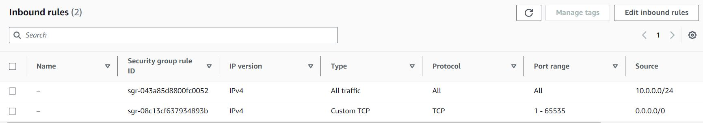

# Lab 10 - NOT READY

- [Lab Procedure](#Lab-Procedure)
- [Submission](#Submission)
- [Rubric](#Rubric)

## Lab Procedure

[Return to here and select "Start Lab"](https://awsacademy.instructure.com/courses/68834/modules/items/6128516)

Use `ssh` to connect to your AWS Ubuntu instance.

Go to the folder that contains your repository (likely named `ceg2350-yourgithubusername`).

**Create a new directory, `Lab10`**

Write answers in `Lab10.md` the [LabTemplate.md is here](LabTemplate.md).

- [Raw version of LabTemplate.md](https://raw.githubusercontent.com/pattonsgirl/CEG2350/main/Labs/Lab10/LabTemplate.md)

For each part below, you will be asked to do an action or answer a question. The actions are going to be commands - you will write the command you used as "answers" to the action requested. You are allowed to use multiple commands to solve an action. Just write down all that were needed to complete. Check with the TAs if you need clarification.

If you did something "wrong" make a note of it in your lab. These are learning experiences - writing them down will help you ask good questions later.

## Part 1 - Linux Network Command Cheat Sheet

The commands below are all Linux commands to show or modify network information.  Provide a brief statement (not a multi-paragraph copy paste :wink:) about what each command does.  You'll be using these commands in Part 2 to find networking info for your AWS instance.

- `hostname`
- `ifconfig`
- `ip addr show`
- `route`
- `cat /var/lib/dhcp/dhclient.leases`
- `cat /etc/resolv.conf`
- `curl ipinfo.io`
- `iptables -L`
- `netcat -z -v <IP_or_hostname>` OR `nc -z -v <IP_or_hostname>`
- `nmap -p <IP_or_hostname>`

## Part 2 - Network Info

For your PC and for your AWS instance, find the following network information.  The point is to find networking info using two different OSes (Windows and Linux OR Mac and Linux).  If you do not have access to a non-Linux OS you can use the laptops or desktops provided in the lab rooms. You should not download any additional tools.

**Additional Useful Commands**
- Windows: `ipconfig \all`

1. Hostname of the device:
2. MAC address of the NIC connected to the network:
3. IPv4 address:
4. Subnet mask:
5. Gateway address:
6. DHCP server address:
7. DNS server address:
8. Public IPv4 address:

- Notes: 
   - These results are going to look boring at home, but interesting on more complex networks, like Wright State or Starbucks.  While you are welcome to do this using your home network, play with these commands on other networks as well. At home you likely have one device (your router) that is the first stop for most requests (DHCP, DNS, and gateway to route traffic to the next stop). On a complex network, you'll see these addresses getting distributed to different devices - there is a device to connect to to request an address and network information (DHCP server), another that is a first stop for DNS resolution, and maybe another that is the gateway address that packets outside the network are forwarded to to find their destination.
   - Public IPv4 addresses are only used when you are trying to send communications outside your local (private) subnet.  The vast majority of networks utilize this scheme.  It allows many devices to be on one network, which then "share" a public IPv4 address when sending packets and receiving communication back from network devices external to your network.

## Part 3 - 

## Part 4 - Security

Your AWS instance has a rule that allows in all traffic from any source, to any port on your AWS instance.  Specifically, they look like this:

Normally, if you had physical access to your instance, we would look at this from the perspective of `iptables` and / or `ufw` rules to allow only trusted networks to access ports on your system, like port 22, which runs a service, SSH, that allows us shell access to the system.  Physical access makes it easy to undo mistakes.  Since we don't, we will use AWS to manage our instance's security rules.

SSH is just software - code - in the end, and code has vulnerabilities.  For all software we track Common Vulnerabilities and Exposures (CVEs).  Specifically for SSH, you can [view the CVE reports here](https://www.cvedetails.com/vulnerability-list/vendor_id-120/SSH.html)

It is a combination of credentials (identity) and network rules that keep systems safe, and allow people to only access what they need.

Your task is to remove both terrible rules from your security group and replace them with the rules outlined below.  Assuming you have hit "Start Lab" and have opened your console via the "AWS" link after the lab has started (timer is counting down), this [link will quick drop you to your Security Groups](https://us-east-1.console.aws.amazon.com/ec2/home?region=us-east-1#SecurityGroups:).  Find the Security Group named **`ceg2350-Lab1SecurityGroup`** (or similar).  Click the checkbox next to that entry or the link in the "Security Group ID" column to focus on only this Security Group.  You will be editing only the **Inbound Rules**

1. Remove the two default rules.  
   - If you lose the ability to connect to your instance, you can recreate them by referring to the Security Group rules picture above.
2. Create a rule that allows SSH access from any WSU IPv4 address, which will be all address from 130.108.0.0 to 130.108.255.255
3. Create a rule that allows SSH access from your home public IPv4 address
   - required even if you live on campus
4. Create a rule that allows HTTP access from any IPv4 address
5. Describe why should HTTP allow any IP, while SSH has restrictions?

**Resources**
- [Subnet Calculator](https://www.davidc.net/sites/default/subnets/subnets.html)

## Extra Credit - Tattle Tale

[auth_logs.csv](auth_logs.csv) is a cleaned up version of standard SSH logs, and contains only the username used in the connection attempt and the IPv4 address the attempt came from.  Take the provided data and give me 2 reports:
- the top 5 IP addresses that generated connection attempts and how many attempts they made
- the top 5 usernames used and how many times they were used

Your reports must contain the set of commands used to create the reports.

- Note: if you are curious about how I parsed `auth.log` to generate the `csv` file, you can [check out my documentation here](https://github.com/pattonsgirl/api-projects/tree/main/ip-mapper/data) - there are likely prettier ways to do it.

## Submission

1. Verify that your GitHub repo has a `Lab10` folder with at minimum:

   - `Lab10.md`

2. In the Pilot Dropbox, paste the URL to the `Lab10` folder in your GitHub repo
   - URL should look like: https://github.com/WSU-kduncan/ceg2350-YOURGITHUBUSERNAME/tree/main/Lab10

## Rubric