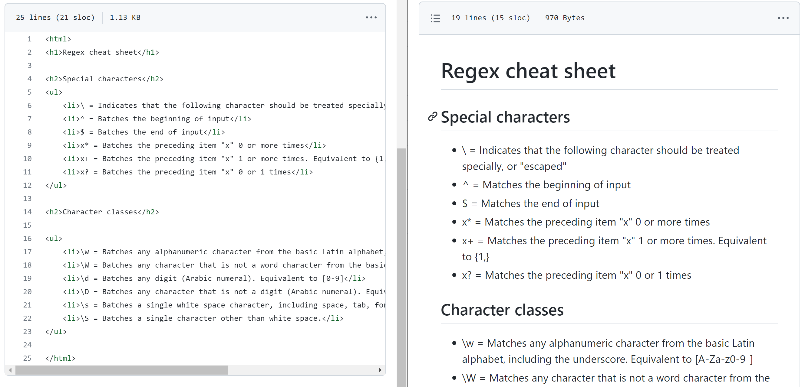

# Lab 05 - regex with grep, sed, and awk

- [Lab Procedure](#Lab-Procedure)
- [regex resources](#regex-resources)
- [Part 1 - grep](#Part-1---grep)
- [Part 2 - sed](#Part-2---sed)
- [Part 3 - awk](#Part-3---awk)
- [Submission](#Submission)
- [Rubric](#Rubric)

## Lab Procedure

Make sure to return to the AWS Learner Lab page (link in Pilot if you forgot to bookmark it) and hit "Start Lab" to turn on your sandbox / AWS instance.

Use `ssh` to connect to your AWS Ubuntu instance.

Go to the folder that contains your repository (likely named `ceg2350-yourgithubusername`).

Create a new directory, `Lab05`.

Create a file named `README.md` in the `Lab05` folder.  The [Lab 05 Template can be copied from this link](https://raw.githubusercontent.com/pattonsgirl/CEG2350/refs/heads/main/docs/Labs/Lab05/LabTemplate.md):

- `https://raw.githubusercontent.com/pattonsgirl/CEG2350/refs/heads/main/docs/Labs/Lab05/LabTemplate.md`

You may refer to additional resources outside of the recommended resources provided.  

Any resource that you use that contributes to your understanding of exercises in this lab should be cited in the `Citations` section of your lab answers.  To add citations, provide the site and a summary of what it assisted you with.  If generative AI was used, include which generative AI system was used and what prompt(s) you fed it.

If you make mistakes with commands in the lab, note them!  Writing down what went wrong and what the correction was will significantly help your learning journey.  If you cannot find a correction, it will help the TAs or myself understand what point you reached and determine some potential solutions.

## Frequently Needed Resources

### regular expressions

These are useful resources for remembering regex syntax and testing your expressions against smaller cases.

- [Mozilla - regex cheatsheet](https://developer.mozilla.org/en-US/docs/Web/JavaScript/Guide/Regular_Expressions/Cheatsheet)
- [regexone - practice regex patterns](https://regexone.com/)
- [regex101 - test regex patterns](https://regex101.com/)

### downloading with wget

When downloading files from the internet by their URL, you'll want to make sure to get the raw file contents - not any additional page wrappers.  

`wget` is a command-line utility for downloading files from the web. With `wget`, you can download files using HTTP, HTTPS, and FTP protocols. `man` `wget` to see the options - we are only going to focus on the URL.

```
wget [options] [url]

```

View this page:  
https://github.com/pattonsgirl/CEG2350/blob/main/docs/Labs/Lab05/data/tryme.txt

Now view this page (accessible by select `Raw` on the right side above the file contents):  
https://raw.githubusercontent.com/pattonsgirl/CEG2350/refs/heads/main/docs/Labs/Lab05/data/tryme.txt

Run the following two commands:
```
wget https://github.com/pattonsgirl/CEG2350/blob/main/docs/Labs/Lab05/data/tryme.txt
wget https://raw.githubusercontent.com/pattonsgirl/CEG2350/refs/heads/main/docs/Labs/Lab05/data/tryme.txt
```
Use `cat` to view their contents.  The second will have only the text file.  The first comes with GitHub's page wrapper.  The second - or more importantly - the raw file contents - is what we want.

## Part 1 - grep

`grep` is a handy command to find patterns in text. There are two flags that enable enhanced regular expressions: `-E` and `-P`. `-E` handles most things, but does not work with special regex letter the represent ranges -`\w` and `\d` for example. To use these characters for the ranges they represent, use the `-P` flag instead of the `-E` flag.

```
grep [OPTIONS] PATTERN [FILE...]
```
In [access.log](data/access.log) you'll find dummy logs for users (client machines) accessing a web server.  Each line contains:
- the client IP
- the access (request) timestamp
- the HTTP Request Method (GET or POST) & resource URL (page)
- the HTTP Status code

Your task is to use both `grep` and `wc` to parse the file for information and report on how many instances were found.  Your searches with `grep` should add in enough patterning to reduce mistakes (inaccurate catches).  

For example: 
- How many logs have a response code of `200`?
   - `grep -E "200$" access.log` 
   - 64 logs had a response code of `200`
   - response codes are at the end of the line, so `200$` would be a good way to create a specific match that would avoid other catches of `200`

1. How many logs use a client IP that starts with `192`?
2. How many logs request page `/faq`?
3. How many logs have a client IP that contains `1` (but not exclusively) in the third octet?
   - `10.12.1.40` - `10` is in the first octet, `12` is in the second, `1` **is in the third** and `40` is in the fourth
   - 21, 12, 11, 210 would all be valid values in third octect
   - Check out note below on format of an IP address
4. How many logs contain `GET` requests to look for a page that begins with `c`?
5. How many logs contains request between 1:20 PM (inclusive) and 1:30 PM (exclusive)?

**Resources**
- [linuxize - use grep to search patterns](https://linuxize.com/post/how-to-use-grep-command-to-search-files-in-linux/)
- [RedHat - Beginners Guide to regular expressions with grep](https://developers.redhat.com/articles/2022/09/14/beginners-guide-regular-expressions-grep#)

**IBM - Format of an IPv4 Address**

An IPv4 address has the format `x.x.x.x`, where `x` is called an *octet* and must be a decimal value between `0` and `255`. Octets are separated by periods - `.`. An IPv4 address must contain three periods and four octets. The following examples are valid IPv4 addresses:
- `1.2.3.4`
- `01.102.103.104`

[IBM article](https://www.ibm.com/docs/en/ts4500-tape-library?topic=functionality-ipv4-ipv6-address-formats)

## Part 2 - sed

`sed` is mostly commonly used as a search and replace command. In [sedfile.html](data/sedfile.html) you'll find an html file. Your task is to change it into markdown using `sed` commands. Your converted file should be named `sedfile.md`.
- [Raw version of sedfile.html](https://raw.githubusercontent.com/pattonsgirl/CEG2350/refs/heads/main/docs/Labs/Lab05/data/sedfile.html)

The following picture shows how `sedfile.html` (the original) looks compared to `sedfile.md` after being fixed to use markdown when the files are viewed in GitHub.



I recommend making a copy of `sedfile.html` and naming it `sedfile.md`. Then use `sed` without modifying the file - once you know your replacement patterns work, then save the changes using `sed`'s `-i` flag.

```
sed -i 's/SEARCH_REGEX/REPLACEMENT/g' INPUTFILE
# -i option tells sed to edit files in place. If an extension is supplied (ex -i.bak), a
# backup of the original file is created otherwise the changes are written back to INPUTFILE
```

Only write the command that performs the required task in the lab write up. DO NOT paste the results.

1. Remove all html end tags - anything with `</stuff>`
   - `stuff` here represents anything surrounded by the HTML close tag: `</ >`
2. Replace all `<li>` tags and the whitespace before the tag with the markdown format for a bullet point: `- `
   - Note that is a dash followed by a single space
3. Replace `<h1>` tags with markdown for header tags: `# `
   - Note that is a hashtag followed by a single space
4. Replace `<h2>` tags with markdown for header tags: `## `
   - Note that is TWO hashtags followed by a single space
5. Remove the `<ul>` tags & remove the `<html>` tag
6. Replace the word `Batches` with the word `Matches`

- **Resources**
- [linuxize - use sed to find and replace](https://linuxize.com/post/how-to-use-sed-to-find-and-replace-string-in-files/)

## Part 3 - awk

`awk` is a full blown scripting language dedicated to text manipulation. See the resources for more examples, but the general format is:
```
awk 'program' input-file
```
In [sales.txt](data/sales.txt) you'll find a file that contains sales records. Your task is to ask some queries and make replacements using `awk`.
- [Raw version of sales.txt](https://raw.githubusercontent.com/pattonsgirl/CEG2350/refs/heads/main/docs/Labs/Lab05/data/sales.txt)

Each lines in `sales.txt` contains the following fields:
- Date (YYYY-MM-DD)
- Product (String)
- Category (String)
- Quantity Sold (Integer)
- Unit Price (Float)
- Total Revenue (Quantity Sold × Unit Price)

Only write the command that performs the required task in the lab write up. DO NOT paste the results.

1. Print only lines for sales made in February 2024
2. Print only the product name of products with a unit price of 100 or more
3. Print the product name and quantity sold of products with `TV` in the product name
4. Sum the total revenue of products with `Kitchen` in the Category name
5. Replace all occurrences of the word `Sofa` with `Couch`.  Save the change to `updates-sales.txt`

- **Resources**
- [linuxize - awk with examples](https://linuxize.com/post/awk-command/)
- [How to Geek - 6 Text Filtering Uses for the Linux awk Command](https://www.howtogeek.com/text-filtering-uses-for-the-linux-awk-command/)
- [cyberbiz - awk find and replace](https://www.cyberciti.biz/faq/awk-find-and-replace-fields-values/)

## Submission

1. Verify that your GitHub repo has a `Lab05` folder with at minimum:

   - `access.log`
   - `sedfile.html`
   - `sedfile.md`
   - `sales.txt`
   - `updated-sales.txt`
   - `README.md`

2. Note that if your command answers in the answer template did not make use of the backtick (`), the TAs are allowed to refuse to grade your submission.  Cleanliness and readability is your responsibility.  

3. In the Pilot Dropbox, paste the URL to the `Lab05` folder in your GitHub repo
   - URL should look like: https://github.com/WSU-kduncan/ceg2350-YOURGITHUBUSERNAME/tree/main/Lab05

## Rubric

Your files should be cleanly presented in your GitHub repository.  Citations should be included as needed.  Include which generative AI system was used and what prompts were used if generative AI was used.

[Rubric](https://raw.githubusercontent.com/pattonsgirl/CEG2350/refs/heads/main/docs/Labs/Lab05/Rubric.md)
