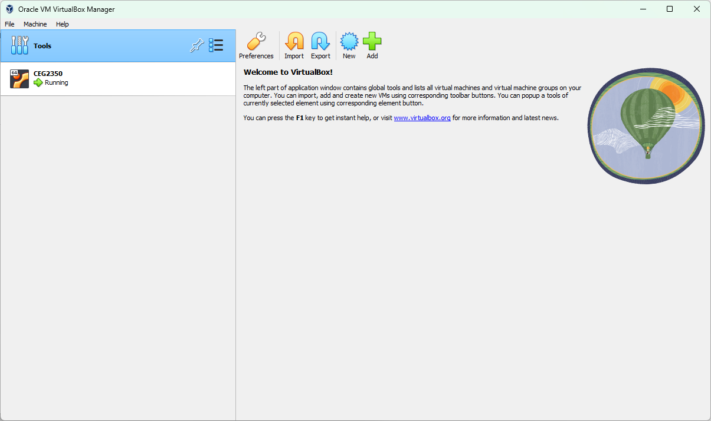
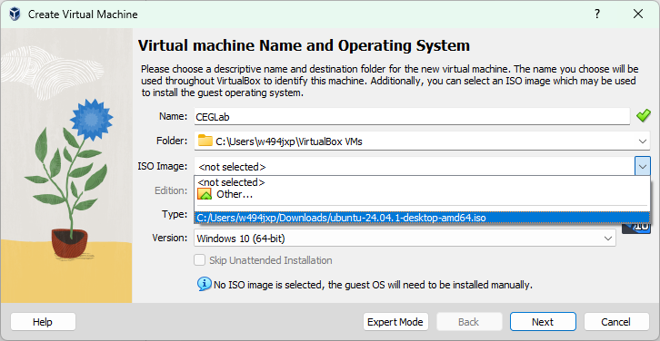
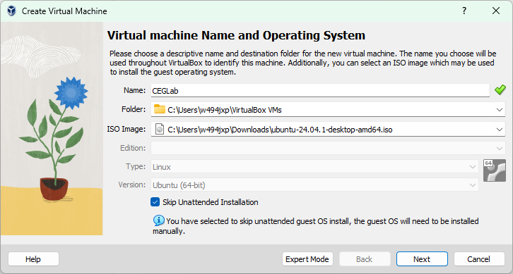
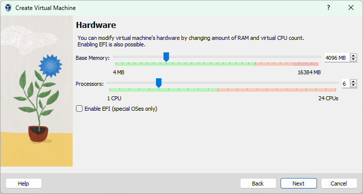
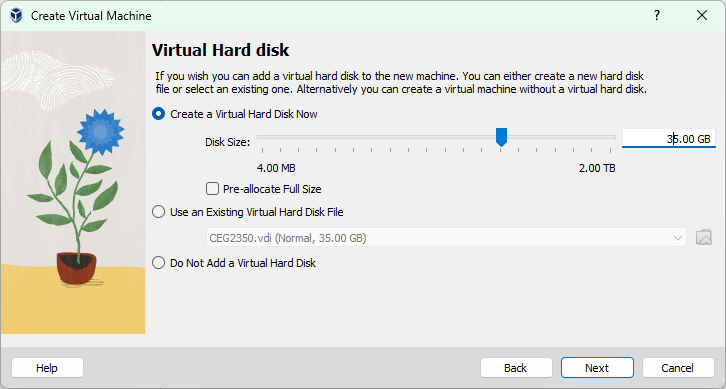
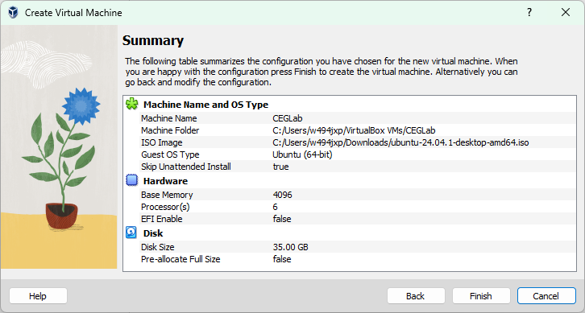
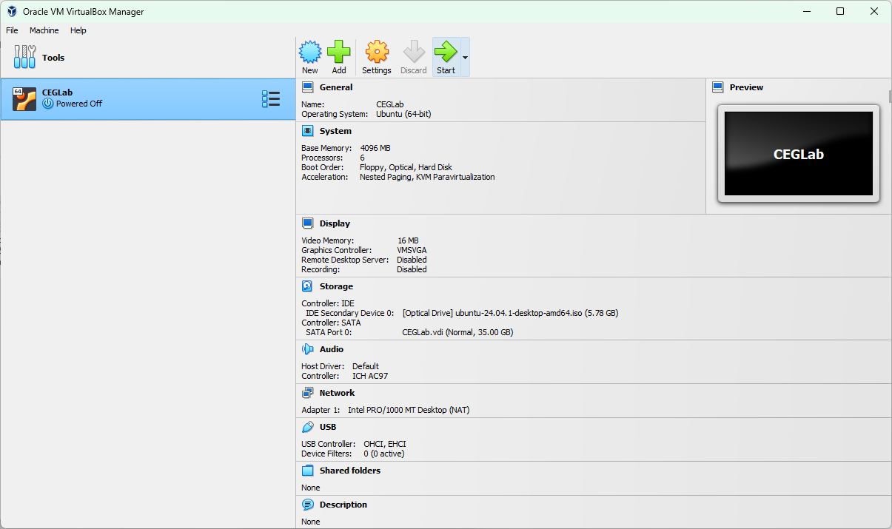
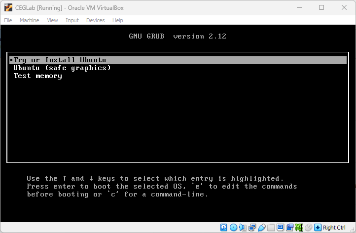

# Guide to Install a VM

### Requirements

- VirtualBox (or any Virtualization software you are using)
- An OS `.iso` image file

---

If you are using VirtualBox, you should see this initial screen

---

From here you want to click on the button that says `New`. It should pop up with a new window with all the options that we will fill out.

In this screen, you can give it whatever `Name` you want for this VM.

For your ISO Image, click on the arrow and then `Other`, then from here find where you store your `.iso` image file.

---

Then at the bottom of the page, there should be a checkbox that says `Skip Unattended Installation`, **Make sure it is CHECKED** (this will make sure you can install your OS manually)

---

We are now going to assign some hardware for the VM. I would **HIGHLY RECOMMEND you to go to the official OS' minimum requirements and follow that**

In this case, for Ubuntu we will give it 4GB of RAM and 6 vCPUs (because the PC I was using was strong enough, but 4 should be enough)

---

Next, we will decide how much storage we are giving to the VM. In this case, for Ubuntu, the minimum requirement is 35GB of storage.

The screenshot shows 35GB but you should **most likely** give it a little more storage, so about 10GB more

---

Then it will put you into a `Summary` page with a summary of your VM

You can verify if all the settings is properly set up.

---

Once you're done, click on `Finish` and you should see the VM created on the main page

In this page, you want to click on the VM you just created, make sure its highlighted blue and then click on `Start`.

From here on, it should start up a VM going to the OS that you installed it, for Ubuntu, you will see a GRUB screen (I'm not sure about every OS, but Ubuntu uses GRUB for it's bootloader).

Whatever image you use, make sure you select `Install OS`. Once you're in the installation, follow the instructions that the OS have for you.

If asked, make sure you install it to the disk because it is inside of a Virtual Disk, so it will not install into your host OS.
