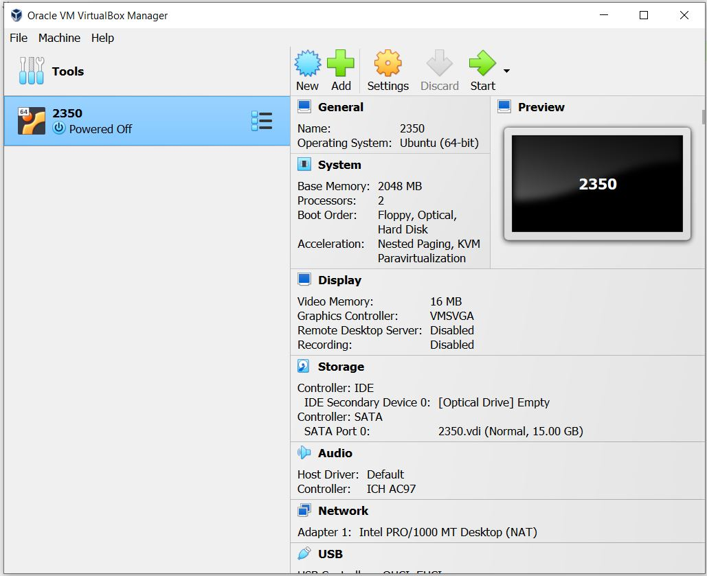

# Lab 07 - System Specs & VMs

- [Lab Procedure](#Lab-Procedure)
- [Part 1 - System Discovery](#part-1---system-discovery)
- [Part 2 - Virtual the Machine](#part-2---virtualize-the-machine)
- [Part 3 - Virtual Playground](#part-3---virtual-playground)
- [Submission](#Submission)
- [Rubric](#Rubric)
- [Windows & WSL2](#windows-and-wsl2)
- [Hints - Screenshots & Markdown](#hints---screenshots-and-markdown)


## Lab Procedure

This lab will have you focusing on your physical system.  Your workflow to complete the companion documentation is up to you.

Go to the folder that contains your repository (likely named `ceg2350-yourgithubusername`).

Create a new directory, `Lab07`.

Create a file named `README.md` in the `Lab07` folder.  Copy into the file the contents of the [Lab 07 Template](LabTemplate.md).

- [Raw version of LabTemplate.md](https://raw.githubusercontent.com/pattonsgirl/CEG2350/main/Labs/Lab07/LabTemplate.md)

You may refer to additional resources outside of the recommended resources provided.  

Any resource that you use that contributes to your understanding of exercises in this lab should be cited in the `Citations` section of your lab answers.  To add citations, provide the site and a summary of what it assisted you with.  If generative AI was used, include which generative AI system was used and what prompt(s) you fed it.

If you make mistakes with commands in the lab, note them!  Writing down what went wrong and what the correction was will significantly help your learning journey.  If you cannot find a correction, it will help the TAs or myself understand what point you reached and determine some potential solutions.

## Part 1 - System Discovery

Find out the following information about your physical system. For the GPU section, you likely only have a integrated or dedicated GPU - not all systems have both.  Only fill out what you have.  

If research proves your system does not support something, leave documentation and supporting articles.

- You can use the manufacturer's website / manuals
- You can post to our course Discord channel for help / hints
  - Ex. "On \_\_ OS, how are you finding \_\_?"
- You should _not_ need to install additional programs to find this information. If an internet article / forum suggests you to install additional software to gather the information, run away.

1. CPU info:
    - CPU brand & model:
    - Number of cores:
    - Number of logical processors:
2. GPU info:
    - Integrated GPU brand & model:
    - Dedicated GPU brand & model: 
    - Link to driver software for GPU: 
3. Memory info:
    - Physical memory (RAM) size (in GB):
    - RAM used at system startup (in GB):
4. Storage info (add section for each disk attached to your system): 
    - Disk 1 type: [HDD, SSD, NVME]
    - Disk 1 brand & model:
    - Total Disk 1 size (in GB):
5. Primary partition / volume info:
    - Primary partition mount point:
      - `C` for Windows users
      - `/` for Linux / Mac users
    - Total space on primary partition (in GB):
    - Space remaining on primary partition (in GB):
    - Filesystem on primary partition:
6. Motherboard info: 
    - BIOS / UEFI manufacturer & version: 
    - How to access BIOS / UEFI:
    - How to enable CPU virtualization: 
    - Link to driver(s) for motherboard: 
7. Kernel / OS info:
    - Bootloader software for system: 
    - Kernel for operating system:
    - Operating System name & version: 

## Part 2 - Virtualize the Machine

You should experience making some hardware choices and installing an operating system. The easiest way to do this is via virtual machines. This allows your host to segment a set of resources to run a machine (a guest) via your host. Developers (and students :wink: ) use VMs to install software that isn't compatible with their host OS, download and explore suspicious packages, create test environments, and other things. Companies will buy a server with massive amounts of resources (200 CPUs, a few terabytes of RAM, a few petabytes of storage) and segment it by creating virtual machines for various software needs. We are using a VM allocated in Amazon Web Services... they are everywhere!

You will need a computer that has CPU virtualization enabled. The lab machines and open lab machines in Russ 152 B & D are all good candidates (and may have VirtualBox already installed). For your own machine, you may need to enable CPU virtualization in your BIOS / UEFI.

The lab template will give an outline of minimum expected documentation for this portion.  The instructions below will provide more verbose guidelines to complete the taskings.

1. Download and install a Virtual Machine Manager. This course will recommend *VirtualBox*
    - [Download and install VirtualBox](https://www.virtualbox.org/wiki/Downloads) Virtual Machine Manager.  
        - Pick your host OS when installing
        - For example, Windows users should select "Windows hosts"
        - Also download the *VirtualBox Extension Pack* for later use.
    - Mac M1, M2, and M3 Users:
      - Mac M\#'s use an ARM based CPU, which means not all software is built for your CPU architecture.  VirtualBox *should* work, but in case it still doesn't, you can either buy a license for Parallels (not recommended) or **UTM (recommended)**
        - [UTM](https://mac.getutm.app/) - free if you click "Download". You can support the developers by paying through the App Store.
    - Windows 11 Users:
      - If VirtualBox is throwing errors, try **Hyper-V Manager** software.  You may need to [Enable Hyper-V Manager](https://www.groovypost.com/howto/enable-virtualization-in-windows-11/)
 
2. Download an ISO (installation image) for a **Linux** distribution with desktop environment of your choice. 
    - The point is to go through the installation process. *Do not download and use a pre-built VM image for this lab*. You may switch to that on your own time.
    - Recommended options include: Ubuntu Desktop, LUbuntu, Linux Mint, Elementary, Kali, Pop OS
        - See [DistroWatch](https://distrowatch.com/) for a comprehensive site about all possible distros        

3. Create a *new* Virtual Machine. Choose your downloaded iso to install from.
    - Pay attention to minimum hardware specifications for the guest operating system you choose. They will guide the minimum hardware you need to assign to the VM for good enough performance.
    - I would recommend 5-10 GB in addition to the minimum disk space required by your choice.

4. Start your Virtual Machine and install the Guest Operating System
    - In some cases, you may need to remove the installation media once you complete the install.  If you complete the install and reboot and are dropped back into the installation prompts after installing, this applies to you.
    - **If using UTM** refer to our [UTM Setup Guide](UTM-Setup.md)
    

## Part 3 - Virtual Playground

Accomplish the following tasks using the guest OS in the virtual machine you made in Part 2. In your lab template, write a "how to" of steps taken to complete each task.

1. Customizing the desktop background in your guest OS
2. Installing VSCode in your guest OS
3. Sharing a clipboard or folder between your host and guest OS
    - In VirtualBox, this involves "Inserting" the Guest Additions CD image, then running the `VBoxLinuxAddition.run` executable as root
4. Cloning your course repository to your guest OS
5. Connecting to your AWS instance from your guest OS using `ssh`

**We plan to use this VM again in future labs.  If you must delete it, make sure your instructions from this lab are good enough to quickly get a new one back up and running**

## Submission

1. Verify that your GitHub repo has a `Lab07` folder with at minimum:

   - `README.md`
   - image files 

2. In the Pilot Dropbox, paste the URL to the `Lab07` folder in your GitHub repo
   - URL should look like: https://github.com/WSU-kduncan/ceg2350s24-YOURGITHUBUSERNAME/tree/main/Lab07

## Rubric

- Part 1 - 22 pts (1 point per information bullet)
- Part 2 - 10 pts (1 point per information bullet / screenshot)
    - if screenshot is not visible in markdown in `README.md`, no credit will be given.
- Part 3 - 10 pts (2 points per task, must include "how-to" steps)

## Windows and WSL2

> Windows Subsystem for Linux (WSL) is a feature of Windows that allows you to run a Linux environment on your Windows machine, without the need for a separate virtual machine or dual booting. WSL is designed to provide a seamless and productive experience for developers who want to use both Windows and Linux at the same time.

Check out the full list of features: https://learn.microsoft.com/en-us/windows/wsl/about

Once upon a time, we required Windows user install WSL2 with Ubuntu in order to use utilities like `ssh`.  I strongly recommend Windows users install this.  Upper level course will expect you to be aware of it and have it if you need it.  Most developers who use Windows systems will have WSL2 with a linux distro in order to access Linux based workflows.

[Install WSL2](https://learn.microsoft.com/en-us/windows/wsl/install)

[Visual Studio Code & WSL2](https://code.visualstudio.com/docs/remote/wsl)

[Video - WSL2 Overview - Network Chuck](https://www.youtube.com/watch?v=vxTW22y8zV8&ab_channel=NetworkChuck)

By default, WSL2 will come with Ubuntu selected as the default distro.  Other options can be viewed in the Microsoft Store or you can find instructions to install a custom distro.

## Hints - Screenshots and Markdown

There are a lot of ways to add screenshots to a markdown file. I'm going to tell you my way. I use my system to take a screenshot, and then I upload files in my repository in GitHub.

Remember when content exists in your repository folder on GitHub, but does not exist in your local folder (the one you usually `git push` from) you need to do a `git pull` to sync back up.

We are going to be uploading images directly to our repository in GitHub, then use `git pull` pull those changes (more specifically, pull the commits which include the changes) to our cloned repositories.

1. Take the screenshots required by part 1. Store them somewhere easy to access (like your Desktop).
2. Go to your GitHub classrooms repo in a browser: https://github.com/WSU-kduncan/ceg2350s24-YOURGITHUBUSERNAME
3. Click the "Add files" button, then click "Upload files"
4. Upload your screenshots. Write commit messages in the browser text fields, then click "Commit Changes"
   - you should now see the images in your repository in GitHub
5. Head back to a terminal where you are working on your Lab 07 documentation
   - type `git pull`
   - you should see your file names appear in the change list
   - and you should now be able to `ls` and see them
6. In your lab template, you have a lines similar to: ``
   - keep the parenthesis, but fill them with the relative path to your respective photos
   - this should be relative to being in your repo folder

```
Either of these will work.  

The first is relative to VBox being in the same folder as the file I'm referencing it in (Lab 07)

The first is an absolute path within the context of the repository

```

Either of these will work.  

The first is relative to VBox being in the same folder as the file I'm referencing it in (Lab 07)

The first is an absolute path within the context of the repository

