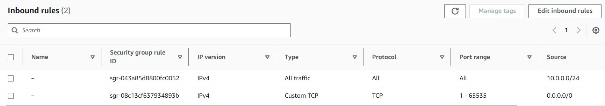

# Lab 12 - Networking & Firewalls

- [General Instructions](#general-instructions)
- [Lab Procedure](#lab-procedure)
- [Part 1 - Networking Basics](#part-1---networking-basics)
- [Part 2 - Security](#part-2---security)
- [Part 3 - Socket Programming](#part-3---socket-programming)
- [Part 4 - Server Testing](#part-4---server-testing)
- [Extra Credit - Tattle Tale](#extra-credit---tattle-tale)
- [Submission](#submission)
- [Rubric](#rubric)
- [Resources](#resources)

## General Instructions

- You may refer to additional resources outside of the recommended ones provided. Cite any resource that contributes to your understanding in the `Citations` section of your lab answers, including the site and a summary of its assistance. If generative AI was used, include the system and prompts.
- If you make mistakes with commands, note them! Writing down what went wrong and the correction will help your learning. If stuck, this aids TAs in understanding where you may have misunderstood or misconfigured a core step.

## Lab Procedure

Make sure to return to the AWS Learner Lab page (link in Pilot if you forgot to bookmark it) and hit "Start Lab" to turn on your sandbox / AWS instance.

Use `ssh` to connect to your AWS Ubuntu instance.

Go to the folder that contains your repository (likely named `ceg2350-yourgithubusername`).

Create a new directory, `Lab12`.

Create a file named `README.md` in the `Lab12` folder. The [Lab 12 Template can be copied from this link](https://raw.githubusercontent.com/pattonsgirl/CEG2350/refs/heads/main/docs/Labs/Lab12/LabTemplate.md):

- `https://raw.githubusercontent.com/pattonsgirl/CEG2350/refs/heads/main/docs/Labs/Lab12/LabTemplate.md`

## Part 1 - Networking Basics

### Linux Network Command Cheat Sheet

The commands below are essential for gathering network information or network testing. Provide a brief statement / summary (**not a multi-paragraph copy paste**) about what each command does **and** find an internet resource that provides a basic guide to what the command does and examples of usage.

| Command                                                | Description | Resource |
|--------------------------------------------------------|-------------|----------|
| `hostname`                                             |             |          |
| `ipconfig` (Powershell)                                |             |          |
| `ifconfig`                                             |             |          |
| `ip a`                                                 |             |          |
| `route`                                                |             |          |
| `iptables -L`                                          |             |          |
| `Invoke-RestMethod ifconfig.me` (Powershell)           |             |          |
| `curl <IP_or_hostname>`                                |             |          |
| `curl ifconfig.me` OR `curl ipinfo.io`                 |             |          |
| `ping <IP_or_hostname>`                                |             |          |
| `nslookup <IP_or_hostname>`                            |             |          |
| `traceroute <IP_or_hostname>`                          |             |          |
| `tracert <IP_or_hostname>` (Powershell)                |             |          |
| `netstat -an \| grep ESTABLISHED`                       |             |          |
| `nmap -p <IP_or_hostname>`                             |             |          |
| `tcpdump -i <networkinterface> -n host <IP_or_hostname>` |          |          |

### Network Info

Find network information for the following systems using the commands and resources from above:
- your host OS on your PC 
- your AWS instance
   - Note: you may need to install the appropriate network utilities to use commands like `ifconfig`

Only complete this for the internet accessible network the system is connected to:
- usually `eth0` for your AWS instance 
- usually `Wireless LAN adapter Wi-Fi` for your laptop

For each system: 

1. Use a command to identify the system's network information. Copy the output into your lab writeup.

2. Use the network info and other commands to fill in the following table for the system's network information:

| Setting                                           | Value |
|---------------------------------------------------|-------|
| Hostname of the device                            |       |
| MAC address of the NIC                            |       |
| Private IPv4 address                              |       |
| Subnet mask                                       |       |
| Gateway address                                   |       |
| DHCP address (if enabled)                         |       |
| DNS server address                                |       |
| Public IPv4 address                               |       |

**Useful Notes**
- At home, the gateway address is typically the same as your DHCP address. It basically says, "use the router for all of it".
- Use `nslookup` to find the DNS server for hostname lookups. At home this may be your ISP DNS server, sometimes it is just the router IP again.
- To resolve the public IPv4 you are using from your ISP, check sites like `ipinfo.io` or `ifconfig.me`. AWS instances have public IPs associated with them.

**Resources** on parsing `ipconfig`, `ifconfig` / `ip` output:
- [How To use the Powershell IPConfig Command and Options Explained - The Lazy Admin](https://lazyadmin.nl/it/ipconfig-command/)
- [Demystifying ifconfig and network interfaces in Linux - Yury Pitsishin](https://codewithyury.com/demystifying-ifconfig-and-network-interfaces-in-linux/)
- [Linux IP Command Explained With Examples - Logic Web](https://www.logicweb.com/knowledge-base/linux-tips/linux-ip-command-explained-with-examples/#3--displaying-ip-addresses)
- [Exploring the Linux 'ip' Command - with comparisons against other commands - Cisco Blog](https://blogs.cisco.com/learning/exploring-the-linux-ip-command)

## Part 2 - Security

Your AWS instance is protected by a firewall via an AWS tool called Security Groups. The default rules created allow broad access (e.g., any IP on any port).

Your instance runs SSH (port 22) and Apache HTTP Server (port 80). In Part 3, you'll play with running a program that listens on another port - 8080. 
- SSH enables secure shell access - access to use this service should be limited to trusted network devices or devices on trusted networks
- Apache serves web content - typically is you host a webpage you want the world (any network device) to be able to request to view the content

Revise Inbound Rules in Security Group `ceg2350-Lab1SecurityGroup`:
- Remove original rules.
- Allow SSH from WSU IPs (130.108.0.0/16).
- Allow SSH from your home public IP
   - Hint: remember how to view query for your public IP from Part 1
- Allow HTTP (port 80) from any IP.
- Allow port 8080 from any (or trusted) IPs.

**AWS Navigation**:
- Start Lab, open AWS console.
- Go to EC2 > Security Groups > Select `ceg2350-Lab1SecurityGroup`.
- Edit Inbound Rules only.

1. Remove the two default rules.  
2. Create a rule that allows SSH access from any WSU IPv4 addresses - 130.108.0.0/16
   - 130.108.0.0/16 = all IPs in range 130.108.0.0 to 130.108.255.255
3. Create a rule that allows SSH access from your home public IPv4 address
   - required even if you live on campus
4. Create a rule that allows HTTP access from any IPv4 address or all addresses from 0.0.0.0 - 255.255.255.255
5. Create a rule (or rules) that allow access to port 8080 from any (or only trusted) IPv4 address
6. Describe how you validated your rules are working.
   - When doing security testing, a base a validation testing is:
      - Something expected to work
      - Something expected to **not** work

If you break access - can no longer `ssh` to your instance - take a screenshot of your rules so you can get assistance, "reset" to default rules shown in the image and try again.

## Part 3 - Socket Programming

Review the following resource to get an overall feel for the difference between ports, sockets, and URLs:
- [Ports, Sockets, and URLs](ports_sockets_url_compare.md)

For this part you'll need two source code files - we have provided Java and Python client and server source code that uses the socket library.

- [Java Client & Server Source Code](https://github.com/pattonsgirl/CEG2350/tree/main/Labs/Lab12/Java)
- [Python Client & Server Source Code](https://github.com/pattonsgirl/CEG2350/tree/main/Labs/Lab12/Python)

Download the source code to your GitHub repository folder - add it for tracking and commit it.

**Create a branch - push this branch to GitHub.  Do not delete the branch after merging**

On this branch:

1. Edit the source code - add comments to help **you** understand what it is doing.  Cite sources that helped you understand.
2. Edit the client side code to refer to your AWS instance using its public IP.
3. Run (compile as well depending on language) the server code on your AWS instance.
4. Run (compile as well depending on language) the client code on your personal system.
5. Send messages to the server from the client.  Add a screenshot to your lab showing the communications between the client and server.
6. Merge your changes to the `main` branch.  Do not delete the branch where you were editing your code.

**Resources**
- [How to Execute and Run Java Code from the Terminal - FreeCodeCamp](https://www.freecodecamp.org/news/how-to-execute-and-run-java-code/)
- [Java Socket Programming - Socket Server, Client example - DigitalOcean](https://www.digitalocean.com/community/tutorials/java-socket-programming-server-client)
- [Socket Programming in Python (Guide) - RealPython](https://realpython.com/python-sockets/)

## Part 4 - Server Testing

Figuring out how to tell if a server is on is one of those MFUS (Most Frequently Used Skills).  Sites like [Down Detector](https://downdetector.com/) are highly informative, but sometimes you need to have other utilities in hand.  The two things we generally ask about servers are: "Is it responding?" and "Is the web page available?".

In this exercise, you will get a set of IPs to test the useful commands on, then a series of questions to guide what I'd like you to understand about them. Your responses should prove how you can validate your answer by testing against the IPs referred to and the commands recommended.

- **Useful Commands:** `ping`, `traceroute`, `nslookup`, `curl`

| Server IPs | Domain Names | URLs  |
| ---       | ---          | ---    |
| `8.8.8.8` |              |        |
| `5.9.243.187` | `wttr.in` | `https://wttr.in` |
| Your AWS instance public IP |     |     |
| `34.117.59.81` | `ipinfo.io` | `https://ipinfo.io` |

1. What are each of the above, what do they respond to, and what requests do they ignore?
2. Does `ping` tell you if a server is "working"?
3. What protocol does `ping` use?  What does this mean about the server firewalls?
4. Why won't `ping` work if you specify `https://` before the domain name?
5. Does an IP lookup always result in finding the correct domain name / URL to access the resource, and vice versa?
6. What happens when an `http` request is made to a server with `https` enabled?  

## Extra Credit - Tattle Tale

[auth_logs.csv](auth_logs.csv) is a cleaned up version of standard SSH logs, and contains only the username used in the connection attempt and the IPv4 address the attempt came from.  Take the provided data and give me 2 reports:
- the top 5 IP addresses that generated connection attempts and how many attempts they made
- the top 5 usernames used and how many times they were used

Your reports must contain the set of commands used to create the reports.

- Note: if you are curious about how I parsed `auth.log` to generate the `csv` file, you can [check out my documentation here](https://github.com/pattonsgirl/api-projects/tree/main/ip-mapper/data) - there are likely prettier ways to do it.

## Submission

1. Verify that your GitHub repo has a `Lab12` folder with at minimum:

   - `README.md`
   - Java or python client code with comments / corrected IP ref
   - Java or python server code with comments

2. In the Pilot Dropbox, paste the URL to the `Lab12` folder in your GitHub repo
   - URL should look like: https://github.com/WSU-kduncan/ceg2350-YOURGITHUBUSERNAME/tree/main/Lab12

## Rubric

Your files should be cleanly presented in your GitHub repository.  Citations should be included as needed.  Include which generative AI system was used and what prompts were used if generative AI was used.

[Rubric](https://raw.githubusercontent.com/pattonsgirl/CEG2350/refs/heads/main/docs/Labs/Lab12/Rubric.md)

## Additional Resources

### Code to use sockets
- [How to Execute and Run Java Code from the Terminal - FreeCodeCamp](https://www.freecodecamp.org/news/how-to-execute-and-run-java-code/)
- [Java Socket Programming - Socket Server, Client example - DigitalOcean](https://www.digitalocean.com/community/tutorials/java-socket-programming-server-client)
- [Socket Programming in Python (Guide) - RealPython](https://realpython.com/python-sockets/)
