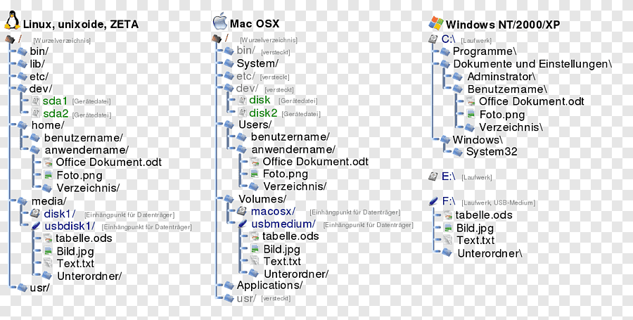

## 01 - Essentials

- [Overview of Core OSes](#overview-of-core-oses)
- [Command Line Essentials](#command-line-essentials)
- [OS Structure, Directories, and Files​](#os-structure-directories-and-files)
- [Users, Groups, Permissions](#users-groups-permissions)
- [SSH, SSH Keys, Basic Usage](#ssh-ssh-keys-basic-usage)
- [Git Basics](#git-basics)

### Overview of Core OSes

> An operating system (OS) is system software that manages computer hardware and software resources, and provides common services for computer programs. - [Wikipedia](https://en.wikipedia.org/wiki/Operating_system)

[Timeline of Operating Systems](https://en.wikipedia.org/wiki/Timeline_of_operating_systems)

This course will be discussing OSes for Personal Computers (PCs). Therefore our conversations will focus on Linux, Windows, and Mac. You will specifically be learning about OS Concepts and Usage through Linux based Operating Systems.

[Windows vs MacOS vs Linux – Operating System Handbook - FreeCodeCamp](https://www.freecodecamp.org/news/an-introduction-to-operating-systems/)

**Video** - [Operating Systems: Creash Course Computer Science](https://www.youtube.com/watch?v=26QPDBe-NB8)

Key takeaways:
- What are the requirements behind the different OSes (what hardware can they run on)
- What are the file system structure differences

### Command Line Essentials

First off, know the terminology differences between a [terminal, console, shell, and command line](https://www.tutorialspoint.com/difference-between-terminal-console-shell-and-command-line)

**Terminal**:  
> Terminal: A software application (emulator) that simulates a physical terminal, allowing interaction with the system from anywhere, even remotely. 

- Windows Terminal [Windows]
- Terminal [Mac]
- GNOME Terminal, Konsole, etc [Linux]

**Console**:
> Console: The original hardware (monitor/keyboard) directly linked to the computer, used for primary system access, boot messages, and low-level tasks. 

> Video game systems are called "consoles" because the term originally described a self-contained control panel or unit that consolidated electronic functions, fitting early game devices like the Magnavox Odyssey, and the name stuck as it distinguished them from general-purpose computers, even as they evolved into dedicated gaming machines with a fixed purpose

**Command Line Shells**:

Command Line Interface:  
> A CLI is a method of user interaction where the user types commands as lines of text to operate software or the operating system, rather than using visual elements like icons and buttons.

Command Line Shell: 
> The specific program that interprets the commands typed into the CLI, executes the corresponding tasks, and manages the interaction between the user and the operating system's kernel. While the term "shell" often implies a command-line interpreter in Unix-like systems, technically a desktop environment like Windows Explorer can also be considered a graphical "shell" (GUI). 

- Bash (Bourne-Again Shell) - default for most Linux OSes
- Zsh (Z Shell) - default for most macOS systems (tied with bash)
- Powershell- default for Windows, now cross-platform
- `cd`, `ssh`, and `git` are all considered command line interfaces

**Shell Commandments**:

1. Thou shalt always read thine output after running a command​
- No output = something worked. So what did you run and what did it do? ​
- Was it what you wanted?​

2. When asking for help, thou shalt give the command AND the output​
- Additionally, whatever steps you remember - some results are a sum of a series of descisions / previously run commands

Commands that you run will likely do one of three things:​
- Succeed quietly​
- Succeed and move to the next step / ask for more info​
- Error and give you a message​

​The errors should be read carefully​
- The errors tell you why the command couldn’t run.

Using your shell gets easier as you pick up customizations, tips and tricks. [7 Linux terminal basics every beginner should learn first](https://www.zdnet.com/article/7-linux-terminal-basics-every-beginner-should-learn-first-and-why/)

**Shell Information**  
At the beginning line in a shell:

- Linux `bash` shells:​ `name@system:~/folder$​`
    - Who you are signed in as​: `name@​`
    - The name of the system​: `@system​`
    - The folder you are in (sometimes)​: `~/folder​`
    - The user mode you are using (sometimes)​
        - `$` = normal user
        - `#` = root user

- Windows `Powershell`: `PS C:\Users\w010ked>`
    - Your shell will have the priviledges of the currently logged in user (to the operating system)
    - `PS` to inform you are using Powershell - no `PS` may mean you are in the Command Prompt `cmd` shell, not Powershell
    - `C:\Users\w010ked` the drive and directory you are in 
    - User mode (admin vs not) will be in the application name
        - `Administrator: Windows Powershell` = Admin mode
        - `Windows Powershell` = normal user

---

**Core Commands**  

- `whoami`
- `hostname`
- `man`
- `help`
- `whatis`
- `history`
- `pwd`
- `ls`
- `cd`
- `cat`
- `touch`
- `vim` & `nano`
- `mkdir`
- `cp`
- `mv`
- `rm`
- `rmdir`

Most command will support *options*, also called *flags*. Look these up everytime whil you are learning, and do not assume that an option in one command is used the same in another. For any given command:
- Use `[command] --help` (or -h) for quick, immediate, and concise information about a command's options and usage.
- Use `man [command]` for in-depth, detailed, and comprehensive documentation, including detailed descriptions, author info, and sometimes examples.
- Use `help [command]` specifically for Bash shell built-in commands (like cd, echo, alias). 

**Bonus Recommendations**  
Be a `vim` power user:
- `vimtutor`
- [OpenVim](https://openvim.com/)
- [vim Adventures](https://vim-adventures.com/)

---

### OS Structure, Directories, and Files​



Some rules of thumb:
- Hidden files and folders will have a `.` in front of the name. Ex, `.bashrc`
- The shell is case sensitive. Upper and lowercase matter
- If a file or directory name has spaces or special characters, you may need to use quotes (`"` or `'`) around the name
- Putting a hashtag `#` in front of the command will make it a comment.

For your OS and Linux OSes, you should know the general structure and purpose behind how the OS is organized on the filesystem:
- [Linux Directory Structure - Linux Handbook](https://linuxhandbook.com/linux-directory-structure/)
- Mac OS Filesystem Basics - see [macOS Standard Directories: Where Files Reside - Apple Developer Guide](https://developer.apple.com/library/archive/documentation/FileManagement/Conceptual/FileSystemProgrammingGuide/FileSystemOverview/FileSystemOverview.html#//apple_ref/doc/uid/TP40010672-CH2-SW6)
- [Windows 10 - and 11 - Directory Structure - Wikipedia](https://en.wikipedia.org/wiki/Directory_structure#Windows_10)

---

**Directories, aka Folders**:
Every directory has a parent directory it belongs to​

The top level directory is parent of itself​

In a directory, if you run "ls –lah", you'll see two listings with dots​

- `.` is a reference to itself​
- `..` is a reference to it's parent
- `*` is a wildcard pattern matcher​
    - `/etc/*-release` will match anything that ends in `-release` in `/etc/`

Relative pathing is a path relative to where you are​
- `class-examples/my_file.txt​`
- `file_open(my_file);​`

Absolute pathing is the full directory path, no shortcuts​
- `/home/ubuntu/class-examples/my_file.txt​`
- `file_open(C:\Users\kduncan\Documents\data\my_file.txt)`


### Users, Groups, Permissions

**Core commands:** 
- `sudo` 
- `stat`
- `chmod`
- `chown`
- `chgrp`
- `adduser` or `useradd`
- `deluser` or `userdel`
- `usermod`
- `groupadd`
- `groupdel`
- `groupmod`
- `su`
- `passwd`
- `id`
- `getent`
- `groups`
- `who`
- `finger`

---

> By design, Linux is a multi-user operating system. In an enterprise system, there would be multiple users accessing the same system. But if any user could access and modify all files belonging to other users or system files, this would certainly be a security risk.

Which file would be accessed by which user is decided by two factors in Linux:
- File ownership
- File permission

Use the `stat [name]` or the `ls -l [name]` to view the file permissions.

```
-rwxrw-r-- 1 abhi itsfoss 457 Aug 10 11:55 agatha.txt
```
- File type: `-` = regular file
    - `d` = directory
    - `l` = symbolic link (shortcut)
    - `b` = block device
    - `c` = character device
- Permission settings: `rwxrw-r--`
- Hard link count: Shows if the file has hard links
    - Default count is one.
- User owner: `abhi`
- Group owner: `itsfoss`
- File size: Size of the file in bytes.
- Modification time: The date and time the file was last modified.
- Filename: Obviously, the name of the file or directory.

**Permission settings**: 

Each letter denotes a particular permission:
- `r` : Read permission
- `w` : Write permission
- `x` : Execute permission
- `–` : No permission set

Permissions are always in the order of read, write and execute, i.e., rwx. And then these permissions are set for all three kind of owners (see the ownership section) in the order of **User**, **Group** and **Other**.

---

Changing permissions in absolute / numeric mode:

In the absolute / numeric mode, permissions are represented in numeric form (octal system to be precise). When Linux file permissions are represented by numbers, it's called numeric mode. In numeric mode, a three-digit value represents specific file permissions (for example, 744.) These are called octal values. The first digit is for owner permissions, the second digit is for group permissions, and the third is for other users.

- 1 = `x` = execute
- 2 = `w` = write
- 4 = `r` = read
- "add" the permissions you want to user, group, and other
    - min is?
    - max is?

`chmod 740 [filename]` would do what to `[filename]`?

---

Changing permissions in symbolic mode:

In symbolic mode, owners are denoted with the following symbols:

- `u` = user owner
- `g` = group owner
- `o` = other
- `a` = all (user + group + other)

The symbolic mode uses mathematical operators to perform the permission changes:

- `+` for adding permissions
- `–` for removing permissions
- `=` for overriding existing permissions with new value

`chmod u+x [filename]` would do what to `[filename]`?  
`chmod o-rw+x,u+x [filename]` would do what to `[filename]`?

---

**Directory Permissions**  
> Directory file types are indicated with d. Conceptually, permissions operate the same way, but directories interpret these operations differently. - [RedHat](https://www.redhat.com/en/blog/linux-file-permissions-explained)

`r` - allows you to read the contents of the directory. However, that means that you can view the contents (or files) stored within the directory. This permission is required to have things like the ls command work.

`w` - allows someone to modify the contents of the directory. When you are changing the contents of the directory, you are either adding files to the directory or removing files from the directory.

`x` - execute permission on a directory authorizes you to look at extended information on files in the directory (using ls -l, for instance) but also allows you to change your working directory (using cd) or pass through this directory on your way to a subdirectory underneath.

---

File permissions across different OSes:
- [Linux File Permissions - Linux Handbook](https://linuxhandbook.com/linux-file-permissions/)
    - Pair with [Linux File Permissions Explained - RedHat](https://www.redhat.com/en/blog/linux-file-permissions-explained) and [Permissions - The Linux Command Line](https://linuxcommand.org/lc3_lts0090.php)
- [Mac File Permissions - MacStadium](https://macstadium.com/blog/understanding-file-permissions-on-mac)
- [Windows File Permissions - 2brightsparks](https://www.2brightsparks.com/resources/articles/a-basic-introduction-to-ntfs-permissions.html)

---

**Users**

There are three basic types of users in Linux – the powerful root user, system users and regular users. 

Root is the super user role created to manage all other users and perform critical actions, such as deleting folders, updating system, connecting to other computers and myriad of others. Root can also assign rights on various levels to all other users.

System users are necessary for Linux to work properly on the background. This type of users are processes, not real users and you can’t use the username to log in.

Regular users are usually allowed to access a shell on the system. They may or may not be members of the `sudo` group or an administrative group that allows them to run commands or a subset of commands with `root` priveledges.

The `/etc/passwd` file is a text file with one entry per line, representing a system or user account.

```
mark:x:1001:1001:mark,,,:/home/mark:/bin/bash
[--] - [--] [--] [-----] [--------] [--------]
|    |   |    |     |         |        |
|    |   |    |     |         |        +-> 7. Login shell
|    |   |    |     |         +----------> 6. Home directory
|    |   |    |     +--------------------> 5. GECOS
|    |   |    +--------------------------> 4. GID
|    |   +-------------------------------> 3. UID
|    +-----------------------------------> 2. Password
+----------------------------------------> 1. Username
```

[Explaining the `/etc/password` file](https://linuxize.com/post/etc-passwd-file/)


There are several different authentication schemes that can be used on Linux systems. The most commonly used and standard scheme is to perform authentication against the `/etc/passwd` and `/etc/shadow` files.

```
mark:$6$.n.:17736:0:99999:7:::
[--] [----] [---] - [---] ----
|      |      |   |   |   |||+-----------> 9. Unused
|      |      |   |   |   ||+------------> 8. Expiration date
|      |      |   |   |   |+-------------> 7. Inactivity period
|      |      |   |   |   +--------------> 6. Warning period
|      |      |   |   +------------------> 5. Maximum password age
|      |      |   +----------------------> 4. Minimum password age
|      |      +--------------------------> 3. Last password change
|      +---------------------------------> 2. Encrypted Password
+----------------------------------------> 1. Username
```
[Explaining the `/etc/shadow` file](https://linuxize.com/post/etc-shadow-file/)

---

**Groups**

A primary group is the default group that a user account belongs to. Every user on Linux belongs to a primary group. A user’s primary group is usually the group that is recorded in your Linux system’s `/etc/passwd` file. When a Linux user logs into their system, the primary group is usually the default group associated with the logged in account.

Once a user has been created with their primary group, they can be added to secondary groups. Linux system users can have a maximum of 15 secondary groups. A Linux system’s groups are stored in the `/etc/group` file.

Analyizing entries in the `/etc/group` file:
```
users:x:100:kduncan,demo
[---][-][--][-----------]   
|     |   |   |   
|     |   |   +---------> 4. Users in group separated by commas
|     |   +-------------> 3. Group ID
|     +-----------------> 2. Password - typically none, thus `x`
+-----------------------> 1. Group name
```

---

**`sudo`**

`sudo` enables a user to have administration privileges without logging in directly as `root`.

In order to provide a user with the `sudo` ability, they need to be added to a `sudo` enabled group, or their username needs to be added to the sudoers file with a set of permissions. This file is sensitive and important as an access and security control, and should not be edited directly with a text editor. If the sudoers file is edited incorrectly it could result in preventing access to the system or other unintended permission changes.

The `visudo` command should be used to edit the sudoers file. At a command line, log into your system as `root` or be on a user account with `sudo` ability and enter the command `visudo`.

The core between the sudoers file and the `sudo` group is that the sudoers file is the central policy configuration across the system or network systems, while the `sudo` group is a convenient, default mechanism defined within that file to manage multiple users at once. Adding a user to the `sudo` group is simply one way to be granted permissions specified in the sudoers file. 

- Terribly formatted [Overview of the sudoers file - Linux Foundation](https://www.linuxfoundation.org/blog/blog/classic-sysadmin-configuring-the-linux-sudoers-file)
- Some examples from a guide on [How to Edit the sudoers file - Digital Ocean](https://www.digitalocean.com/community/tutorials/how-to-edit-the-sudoers-file)

---

Managing permissions, users, and groups on different OSes

- Linux
    - [Linux Users and Groups - Linode](https://www.linode.com/docs/guides/linux-users-and-groups/)
- Mac
    - [Owners and groups in the Finder and command line - The Eclectic Light Company](https://eclecticlight.co/2018/03/22/owners-and-groups-in-the-finder-and-command-line/)
    - [Change Users & Groups settings on Mac - Mac User Guide](https://support.apple.com/guide/mac-help/change-users-groups-settings-mtusr001/mac)
- Windows
    - **Note** Windows is going to *assume* you are in an Active Directory environment where your system and account are managed by an enterprise. Be specific about *local* accounts and groups when searching for info
    - Basic ways to [Manage User Accounts in Windows - Microsoft Support](https://support.microsoft.com/en-us/windows/manage-user-accounts-in-windows-104dc19f-6430-4b49-6a2b-e4dbd1dcdf32)
    - [How to manage local users and groups in Windows - Digital Citizen](https://www.digitalcitizen.life/geeks-way-managing-user-accounts-and-groups/)
    - [How to Manage Local Users and Groups using PowerShell - Microsoft Tech Community](https://techcommunity.microsoft.com/blog/itopstalkblog/how-to-manage-local-users-and-groups-using-powershell/733544)

### SSH, SSH Keys, Basic Usage

**Core Commands:**
- `ssh`
- `ssh-keygen`

In this course, you will be learning key functions of `ssh` - Secure SHell.

**SSH** (Secure Shell) is a cryptographic network protocol that provides a secure, encrypted connection between two computers over an insecure network. It is used for tasks such as: 
- Secure remote command-line access (terminal access)
- Secure file transfers (SFTP, SCP)

**SSH Keys** are a set of access credentials used within the SSH protocol to authenticate a user or system using public-key cryptography. SSH keys often replace password based authentication. A key pair consists of two parts: 
- **Private Key**: This key is secret and must be stored securely on the client machine (the computer you are connecting from). It is never shared over the network.
- **Public Key**: This key can be shared freely and is placed on the remote server (the computer you are connecting to). The server uses it to verify the identity of the client holding the corresponding private key without the private key ever leaving the client's machine. 

---

**SSH Usage**

```
ssh -i <private_key> username@hostname
```
- private_key is the name of or path to and name of the private key on the *client* / local system
- username is the username on the *remote* system that you are connecting to
- hostname is the hostname (github.com) or public ip of the *remote* system

The process (for dummies edition):
1. Client attempts ssh connection to remote system
    - if remote system is offline or if firewalls have ssh blocked, you'll be denied
2. Remote system sends fingerprint to client. Client checks it against previous remote system's it has talked to with `ssh`. 
    - the client's `~/.ssh/known_hosts` will keep a list of server fingerprints. Generally, fingerprints should not change
    - If your client has not communicated with the remote system before using ssh, the following message will appear:
```
The authenticity of host ‘example.com (93.184.216.34)’ can't be established.
ECDSA key fingerprint is SHA256:d029f87e3d80f8fd9b1be67c7426b4cc1ff47b4a9d0a84.
Are you sure you want to continue connecting (yes/no)?
# If you type `yes` the remote system's fingerprint will be added to the client's 
#   `~/.ssh/known_hosts` file for the current user account
```
3. Login request is initiated.
    - Remote server seeks matching public key to private key in the remote user's `authorized_keys` file
    - The remote user's `~/.ssh/authorized_keys` file is a list of all **public** keys 
    - Password authentication *may* still be used, but is no longer considered secure
4. Remote server sends client a message encrypted with the public key, client must decrypt the message with the private key.
5. The client sends back the message and the server verifies success (or failure)

Resources that give you all the details:
- [What is SSH - Hostinger](https://www.hostinger.com/tutorials/what-is-ssh)
- Video - [How SSH Really Works - Byte Byte Go](https://www.youtube.com/watch?v=rlMfRa7vfO8)

```
ssh-keygen -t ed25519 -C "comment here"
```
- `-t ed25519` specifies encryption type (ED25519 is a standard)
- `-C "comment here"` is just a comment left in your public key for reference

The rules:
- Private keys must:
    - be in a file available on the client system
    - be accessible only by the user - groups members and others on the system should have no access
- Public keys can:
    - be readable by anyone
    - be added to a remote user's `~/.ssh/authorized_keys` file
    - be shared with remote systems, like GitHub, to use SSH authentication

Resources that go more in depth than we need:
- [Use public key authentication with ssh - Linode](https://www.linode.com/docs/guides/use-public-key-authentication-with-ssh/)

### Git Basics

> Git is a distributed version control software system that is capable of managing versions of source code or data. It is often used to control source code by programmers who are developing software collaboratively. - [Wiki](https://en.wikipedia.org/wiki/Git)

> GitHub is a proprietary developer platform that allows developers to create, store, manage, and share their code. It uses Git to provide distributed version control and GitHub itself provides access control, bug tracking, software feature requests, task management, continuous integration, and wikis for every project. GitHub is operated by Github, Inc., a subsidiary of Microsoft since 2018 which is headquartered in San Francisco. - [Wiki](https://en.wikipedia.org/wiki/GitHub)

**Core `git` CLI commands**:
- `clone`
- `init`
- `status`
- `add`
- `commit`
- `push`
- `pull`
- `config`
- `remote`


The general steps of accessing and using a git repository hosted on GitHub:

1. Create (or determine) an `ssh` keypair for authentication with GitHub. Add public key to your user's profile settings.
2. `clone` the repository using `ssh`
    - make sure `SSH` is selected if using the Code dropdown in GitHub
    - click "Clone Repository" if using the Source Control menu in VSCode
3. Create / edit files as normal in your *Working Directory*
4. `add` the files with changes you want to mark to the *Staging Area*
5. `commit` changes to staged files to the *Local Repository* 
    - use a commit message to give human readable context to the generated commit point
    - Commits will require authorship.
        - Configure username: `git config --global user.name "Your Name"`
        - Configure email: `git config --global user.email "your_email@example.com"`
6. `push` one or more commits to the *Remote Repository* - GitHub
7. `pull` if changes exist in GitHub that are not in the *Local Repository* 

Video [How Git Works - Byte Byte Go](https://www.youtube.com/watch?v=e9lnsKot_SQ)

In this course, you'll learn three ways to manipulate git repositories in GitHub:

1. Beginner - [Editing files in the GitHub browser](https://docs.github.com/en/repositories/working-with-files/managing-files/editing-files)
2. Average - [Staging, commiting, and syncing in VSCode](https://code.visualstudio.com/docs/sourcecontrol/staging-commits)
3. Advanced - [Using `git` `add`, `commit`, and `push` on the command line](https://graphite.com/guides/git-add-commit-push)

We'll get to more collaborative features - like branches, Issues, and Pull Requests - later in this course.

