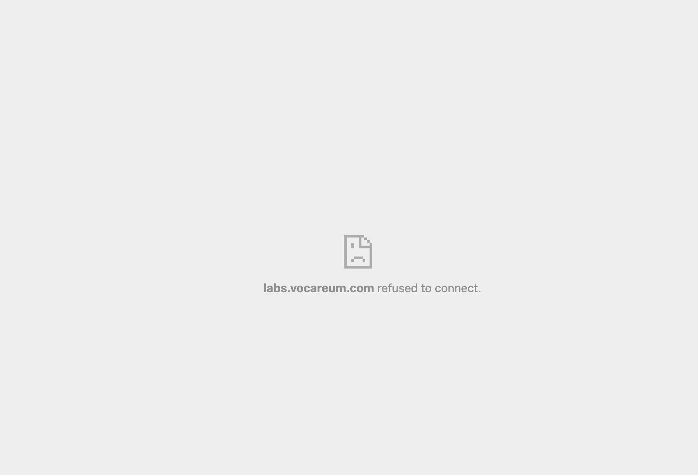

# AWS Academy Instructions

- [Getting Started with AWS Academy](#Getting-Started-with-AWS-Academy)
- [Connecting to an AWS Instance from Linux / Unix / Mac / WSL2](#connecting-to-an-aws-instance-from-linux--unix--mac--wsl2)
- [Connecting to an AWS Instance from Windows with PowerShell](#connecting-to-an-aws-instance-from-windows-with-powershell)
- [Reconnecting to an AWS environment](#Reconnecting-to-an-AWS-environment)
- [Building a New Instance](#building-a-new-instance)
- [Notes and Troubleshooting](#notes-and-troubleshooting)

## Getting Started with AWS Academy

1. Open email from AWS Academy to accept invite to course.
   - Email your course instructor if you did not receive an email.
2. You will be joined to a Canvas course called AWS Academy Learner Lab - Foundation Services
   - If you are in multiple courses using AWS, you may need to get used to the "Dashboard" to spend funds in the correct course.
3. Within the course, click **Modules**
4. Click **Learner Lab**
   - Read and Agree to the Terms and Conditions
5. Click the **Start Lab** Play button on the middle right
6. Wait. 2 - 3 minutes. You will see a console appear that you can interact with.
   - This terminal is configured with AWS CLI access - you can query resources created on your account with it, but in itself is not what we are aiming for. Proceed with next instructions.
7. Click **AWS Details** (with info icon next to it). Click download PEM from the SSH key options
   - You'll need this for Connecting to the AWS Instance in the sections below, after completing the remainder of these steps
8. Click **AWS** which should have a green dot next to it located on the left
   - This will take you to your AWS Console for your account. Now the fun begins.
9. In a new tab, enter the following URL in the browser (or click link to open): <a href="https://console.aws.amazon.com/cloudformation/home?region=us-east-1#/stacks/new?stackName=ceg2350&templateURL=https:%2F%2Fwsu-cecs-cf-templates.s3.us-east-2.amazonaws.com%2Fcourse-templates%2Fceg2350.yml" target="_blank">https://console.aws.amazon.com/cloudformation/home?region=us-east-1#/stacks/new?stackName=ceg2350&templateURL=https:%2F%2Fwsu-cecs-cf-templates.s3.us-east-2.amazonaws.com%2Fcourse-templates%2Fceg2350.yml</a>

   - On the first menu, click Next
   - On the second menu, under Parameters, under Key Name, select `vockey`
   - Click Next
   - On the third menu, select Next
   - Scroll to the bottom and select Submit
   - You will be redirected to a status page that says CREATE_IN_PROGRESS
   - Refresh this page until CREATE_COMPLETE is the status

10. Once you have created the AWS Cloud formation stack you can [return to the EC2 menu](https://console.aws.amazon.com/ec2/v2/home?region=us-east-1#Home:).  
    Here you should see additional resources have been created (not everything says 0 anymore)
11. Click on [Running Instances](https://console.aws.amazon.com/ec2/v2/home?region=us-east-1#Instances:sort=instanceState)
12. Our instance should now be created (or almost ready).  Select the checkbox next to the instance name "CEG 2350" to see all details about this instance.
13. Your instance will be assigned a unique Elastic / Public IP address. This IP address is what we will use to SSH to the instance.

**You are now ready to make an SSH connection to your AWS server.**

View the Connection instructions below appropriate to the system you are using to create a connection - the client system.

**WARNING**
While exploring and discovery is an important part of this course, any additional resources you create in AWS have an associated charge. If resources besides those strictly asked for by this course stay running, you risk running out of funds for this course. This will hinder your ability to complete assignments on time.

## Connecting to an AWS Instance from Linux / Unix / Mac / WSL2

1. Open your Terminal program.
2. Copy or navigate to the AWS SSH key that was downloaded to your system to your home directory in your terminal

   - Helpful commands: `cd, cp, ls, man`
   - If using copy / paste method:
   - Create a file with a useful name (or the same name as the downloaded file) `ceg3120-aws-vm.pem`
   - Open a text editor (`vim` or `nano`)
   - Copy and paste the contents of the key that was downloaded / viewed from AWS Details into the file.

3. Change the permissions on the key file in your directory

   - Because private keys need to be protected, the key needs to be changed to readable by your user by using `chmod`
   - `chmod 600 /path/to/private/key` - replace _/path/to/private/key_ with your information
   - Resource on how to use [chmod](https://www.howtogeek.com/437958/how-to-use-the-chmod-command-on-linux/)

4. SSH into your AWS server with the following command  
   `ssh -i /path/to/private/keyfile ubuntu@ElasticIP`  
   Note: replace _/path/to/private/keyfile_ and _ElasticIP_ with your information
   - If your connection was refused, you may have forgotten to put the username `ubuntu` in front of your Elastic IP address
5. You are now signed in to your AWS instance as the user `ubuntu`

## Connecting to an AWS Instance from Windows with PowerShell

**You are now ready to make an SSH connection to your AWS server.**

1. Open PowerShell.
2. Navigate to the AWS SSH key that was downloaded to your system.

   - Helpful commands: `cd, ls`
   - If using copy / paste method: 
   - Create a file with a useful name (or the same name as the downloaded file) `ceg3120-aws-vm.pem`
   - Open a text editor (`notepad.exe` or `code`)
   - Copy and paste the contents of the key that was downloaded / viewed from AWS Details into the file.
   - Make sure to enter a new line character at the end of the file.

3. By default, Windows sets permissions of newly created files as your user in your user's folder to be accessible only by you.

4. SSH into your AWS server with the following command  
   `ssh -i C:/path/to/your/keyfile ubuntu@ElasticIP`  
   Note: replace _C:/path/to/your/keyfile_ and _ElasticIP_ with your information
   - If your connection was refused, you may have forgotten to put the username `ubuntu` in front of your Elastic IP address
5. You are now signed in to your AWS instance as the user `ubuntu`

## Reconnecting to Your AWS environment

Every 4 hours, instances (virtual machines) on AWS will automatically power down. This is good - it saves funds and use of resources. However, every 4 hours you need to restart the timer OR **Start Lab** again.

1. Log on to the [AWS Canvas portal](https://awsacademy.instructure.com/login/canvas)
   - Opens new page: <a href="https://awsacademy.instructure.com/login/canvas" target="_blank">AWS Canvas portal</a>
2. Within the course, click **Modules**
3. Click **Learner Lab - Foundational Services**
4. Click the **Start Lab** Play button on the middle right
5. Wait. 2 - 3 minutes. You will see a console appear that you can interact with.
6. Click **AWS** which should have a green dot next to it located on the left
   - This will take you to your AWS Console for your account.
   - The light next to **AWS** should now be **green**
7. Be patient, but you should now be able to `ssh` in to your instance with your private key to the same IP as before

## Building a New Instance

Lost your private key? Following internet advice to try `rm -rf /*`?  You may need to start over with a new instance.

Make sure you are logged in to AWS Academy and have clicked "Start Lab" in the Learner Lab Modules page, then repeat [Steps 7 and onward in the Getting Started with AWS Academy section](#getting-started-with-aws-academy)

## Notes & Troubleshooting

- Sessions last 4 hours. Session time can be refreshed. Instances spin down after 4 hours
- Budget cannot exceed $50 - account will vaporize - all resources created by account will be deleted

### Connection Refused

1. Enable Third Party Cookies
2. Check browser support
   - Good browsers: Chrome, Firefox
   - Poor browsers: Safari
