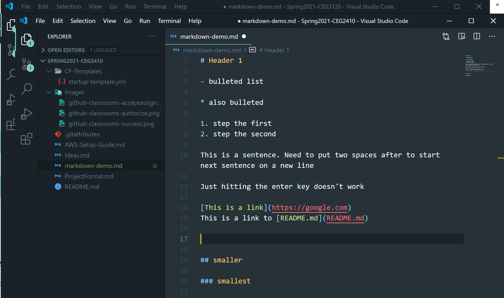

# Markdown Guide

- [Headers](#Headers)
- [Paragraphs](#Paragraphs)
- [Lists](#Lists)
- [Links & Images](#Links-&-Images)
- [Code](#Code)

## Headers

```
# Markdown Guide
## Headers
### Bulleted
```

## Paragraphs

Put two spaces after this line followed by `Enter` to start new line.

Just hitting the enter key doesn't work

## Lists

### Bulleted

```
- bulleted list
* also bulleted
```

- bulleted list
  - indented list

* also bulleted

### Numeric

```
1. step the first
2. step the second
```

1. step the first
2. step the second

## Links & Images

### Links

```
This is a link to [Google](https://google.com)
This is a link to [README.md](README.md)
```

This is a link to [Google](https://google.com)  
This is a link to [README.md](README.md)

### Images

```

```


## Code

````
Single out one word with `single` back quotes
\```
Block off a chunk off code by
   surrounding it
   with triple back quotes
\```
````

Single out one word with `single` back quotes

```
Block off a chunk off code by
   surrounding it
   with triple back quotes
```
